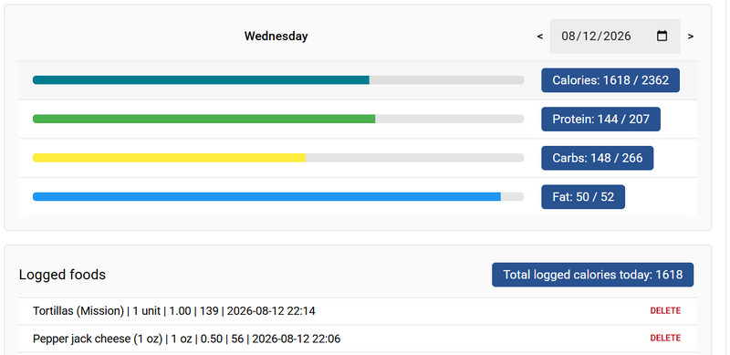
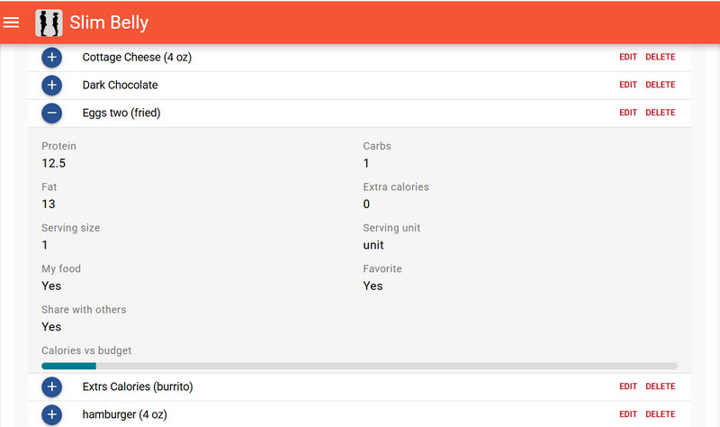
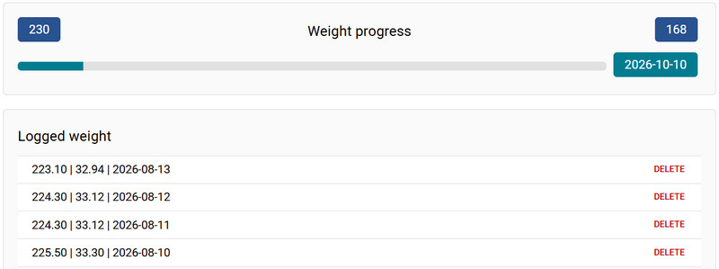

# 🥗 Slim Belly

> **Your daily companion for smarter nutrition, healthier habits, and measurable progress.**

**Slim Belly** is a health and wellness diary designed to help you track your daily habits, monitor your progress, and gain meaningful insights into your overall well-being.

By consistently tracking your nutrition, activity, and wellness habits, you can better understand your health patterns and make informed decisions to support a healthier lifestyle.

---

## ✨ Features

### 🍎 Track Your Nutrition

Follow a nutrition profile that fits your goals and keep track of your daily macros.

Choose from:

* **Balanced** — A well-rounded approach to daily nutrition
* **Low Carb** — Reduce carbohydrate intake while focusing on nutritious foods
* **High Protein** — Prioritize protein-rich foods to support your goals
* **High Metabolic** — Follow a metabolism-focused nutrition approach

### 🍽️ Manage Your Meals

Keep a daily record of what you eat and stay aware of your nutrition throughout the day.

### 🛒 Keep Track of Your Food

Organize and review the foods that make up your daily nutrition plan.

### ⚖️ Monitor Your Progress

Track changes over time and visualize your weight progress to better understand your journey.

---

## 📊 Your Daily Wellness Diary

Slim Belly brings the important pieces of your wellness routine together in one place:

| Feature            | Description                                                       |
| ------------------ | ----------------------------------------------------------------- |
| 🍽️ **Meals**      | Track what you eat throughout the day                             |
| 🥗 **Macros**      | Monitor protein, carbohydrates, fats, and other nutritional goals |
| 🏃 **Exercise**    | Keep track of your exercise and daily activity                    |
| 💊 **Supplements** | Record your daily supplements                                     |
| ⚖️ **Weight**      | Monitor weight changes over time                                  |
| 📈 **Progress**    | Visualize your progress and identify trends                       |
| 🎯 **Goals**       | Stay focused on your personal wellness objectives                 |

---

## 🌱 Build Better Habits

Small, consistent actions can make a big difference.

Use **Slim Belly** regularly to:

* Understand your eating patterns
* Stay accountable to your nutrition goals
* Monitor your progress
* Track exercise and supplements
* Identify trends in your wellness journey
* Make more informed lifestyle decisions

---

## 🚀 Getting Started

1. Choose the nutrition profile that best fits your goals.
2. Track your meals and daily macros.
3. Record your exercise and supplements.
4. Monitor your weight and progress.
5. Review your habits regularly and adjust as needed.

---

## 🎯 Your Health. Your Habits. Your Progress.

**Slim Belly** makes everyday wellness tracking simple, visual, and actionable — helping you turn your daily choices into long-term healthy habits.
